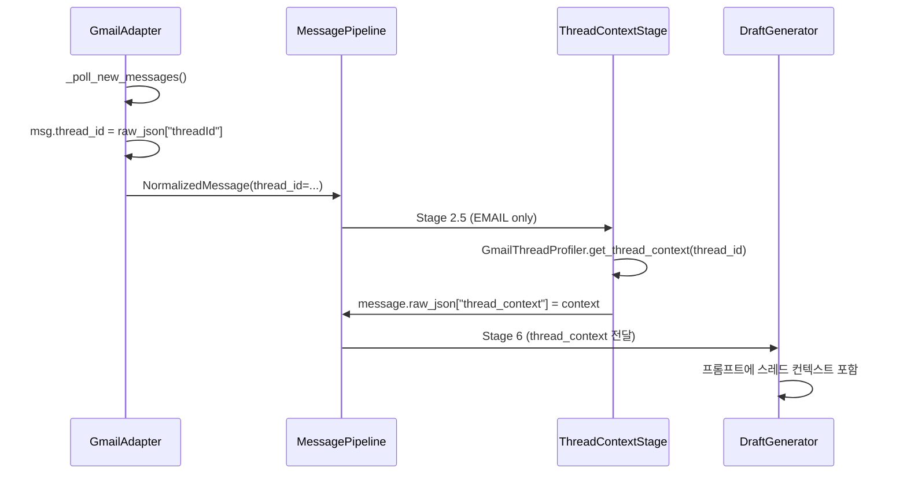
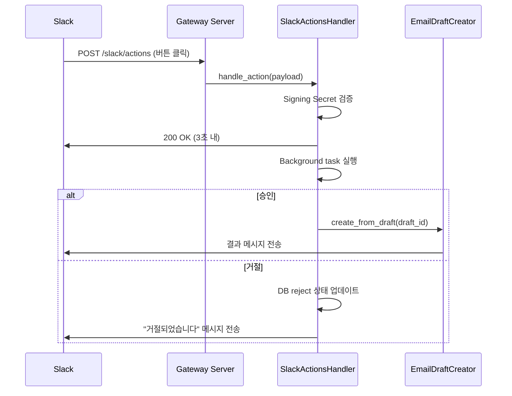
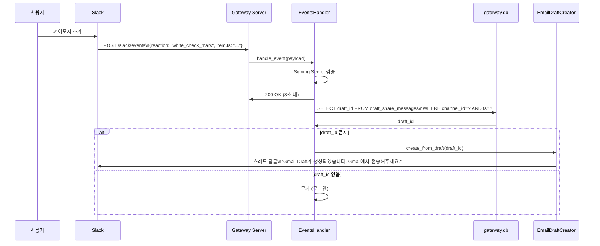
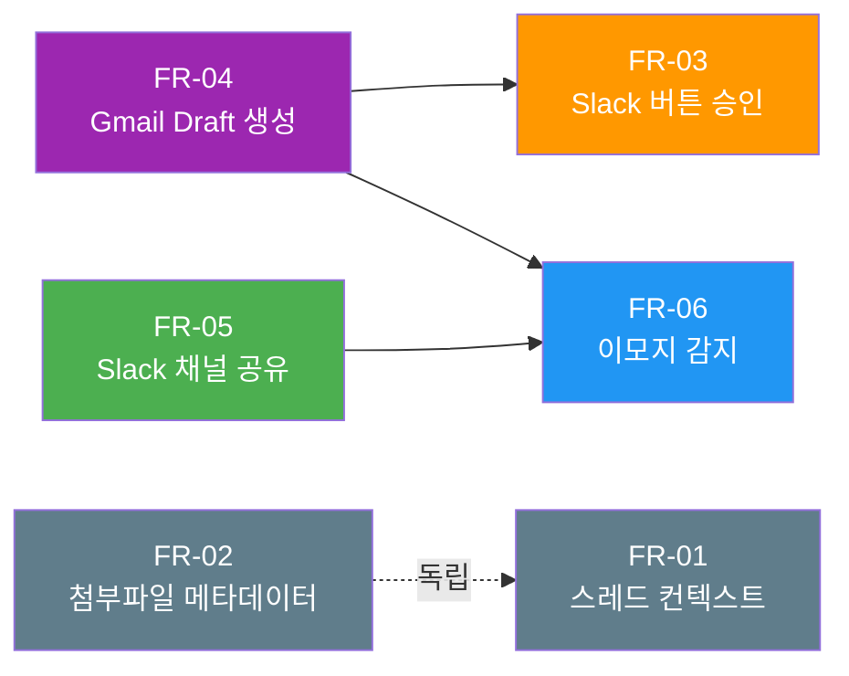
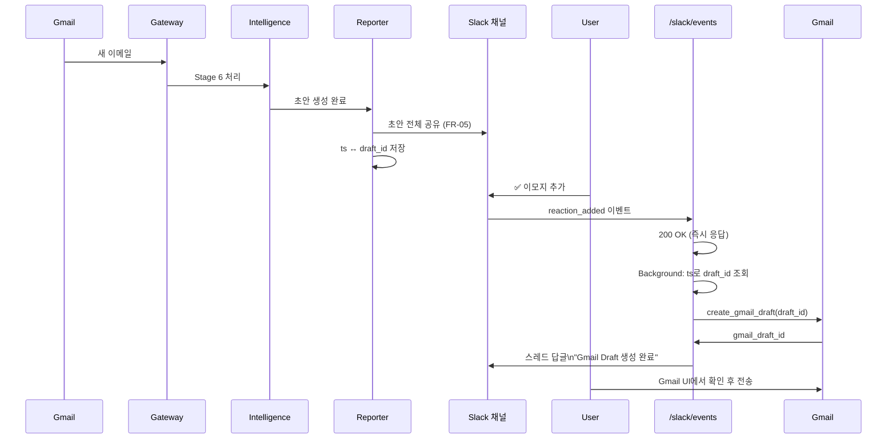

# 이메일 워크플로우 개선 PRD

**버전**: v1.0.0 | **날짜**: 2026-02-23 | **상태**: Draft

---

## 목차

1. [배경 및 문제 정의](#1-배경-및-문제-정의)
2. [목표](#2-목표)
3. [기능 요구사항](#3-기능-요구사항)
   - [FR-01: 이메일 스레드 컨텍스트 수집 및 분석 주입](#fr-01-이메일-스레드-컨텍스트-수집-및-분석-주입)
   - [FR-02: 첨부파일 메타데이터 추출](#fr-02-첨부파일-메타데이터-추출)
   - [FR-03: Slack 버튼 승인 (Block Kit)](#fr-03-slack-버튼-승인-block-kit)
   - [FR-04: 승인 후 Gmail Draft 자동 생성](#fr-04-승인-후-gmail-draft-자동-생성)
   - [FR-05: Slack 채널에 이메일 초안 전체 공유](#fr-05-slack-채널에-이메일-초안-전체-공유)
   - [FR-06: Slack ✅ 이모지 리액션 감지 → 이메일 처리 자동화](#fr-06-slack--이모지-리액션-감지--이메일-처리-자동화)
4. [제약사항](#4-제약사항)
5. [구현 우선순위](#5-구현-우선순위)
6. [비기능 요구사항](#6-비기능-요구사항)
7. [데이터 모델 변경](#7-데이터-모델-변경)
8. [외부 의존성](#8-외부-의존성)
9. [전체 흐름도](#9-전체-흐름도)

---

## 1. 배경 및 문제 정의

secretary 프로젝트는 Gmail 수신, 파이프라인 처리, LLM 기반 분석이 완전히 구현되어 있다. 그러나 이메일 워크플로우의 마지막 단계—사용자가 초안을 검토하고 회신을 전송하는 과정—에서 세 가지 Pain Point가 존재한다.

### 1.1 Pain Point 분석

| # | Pain Point | 현황 | 영향 |
|---|-----------|------|------|
| P-01 | **초안 승인 UX 복잡** | CLI `python scripts/intelligence/cli.py drafts approve <id>` 수동 실행 필요 | 비기술 사용자 접근성 저하, 승인 지연 |
| P-02 | **이메일 스레드 컨텍스트 없음** | `GmailThreadProfiler`가 구현되어 있으나 파이프라인에 미연결 | 초안 품질 저하 (이전 대화 맥락 누락) |
| P-03 | **첨부파일 미지원** | `NormalizedMessage.media_urls`가 빈 리스트로 방치됨 | 첨부파일 포함 이메일 컨텍스트 불완전 |

### 1.2 현재 아키텍처 현황

```
Gmail (수신)
    ↓
GmailAdapter._poll_new_messages()
    ↓ NormalizedMessage (thread_id = None, media_urls = [])
MessagePipeline (Stage 1-3, 5, 6)
    ↓
ProjectIntelligenceHandler
    ↓ OllamaAnalyzer → EscalationRouter → ClaudeCodeDraftWriter
IntelligenceStorage (drafts 테이블)
    ↓
CLI 수동 조회 및 승인
```

**문제**: 수신에서 승인까지의 사이클이 끊겨 있으며, 사용자가 CLI를 통해 개입해야 하는 단계가 불필요하게 복잡하다.

---

## 2. 목표

### 2.1 비즈니스 목표

이메일 수신 → 분석 → 초안 생성 → 승인 → Gmail Draft 생성 전체 사이클을 Slack 기반 UI로 통합하여 사용자가 **Slack을 벗어나지 않고** 이메일 워크플로우를 완결할 수 있게 한다.

### 2.2 기술 목표

| 목표 | 지표 |
|------|------|
| Slack UI 기반 초안 승인 자동화 | CLI 없이 ✅ 이모지 또는 버튼으로 승인 가능 |
| 스레드 컨텍스트 주입으로 초안 품질 향상 | 기존 구현(`GmailThreadProfiler`) 파이프라인 연결 |
| 첨부파일 메타데이터 시각화 | 파일명/MIME 타입/크기 NormalizedMessage에 포함 |
| Gmail Draft 생성 자동화 | 승인 시 자동으로 Gmail Draft 생성 (전송은 사용자 수동) |

### 2.3 범위 외 (Out of Scope)

- 이메일 자동 전송 (안전 규칙 — 절대 금지)
- 첨부파일 내용 다운로드 또는 파싱
- 다국어 이메일 번역
- 모바일 앱 지원

---

## 3. 기능 요구사항

### FR-01: 이메일 스레드 컨텍스트 수집 및 분석 주입

#### 개요

`GmailThreadProfiler`(`scripts/knowledge/gmail_thread_profiler.py`)는 이미 구현되어 있으나 파이프라인에 연결되어 있지 않다. 이 FR은 기존 구현을 파이프라인에 통합하는 작업이다.

#### 변경 대상

| 파일 | 변경 내용 |
|------|----------|
| `scripts/gateway/adapters/gmail.py` | `_poll_new_messages()`에서 `NormalizedMessage.thread_id` 명시 할당 (현재 `raw_json`에만 존재) |
| `scripts/gateway/pipeline.py` | Stage 2.5 `GmailThreadContextStage` 추가 (EMAIL 채널에만 실행, 비차단) |
| `scripts/intelligence/response/draft_generator.py` | `_generate_draft()`에 `thread_context` 파라미터 전달 |

#### 처리 흐름



#### 세부 요구사항

- `GmailThreadContextStage`는 `thread_id`가 없는 메시지를 조용히 스킵 (비차단)
- 스레드 컨텍스트 수집 실패 시 로그만 남기고 파이프라인 계속 진행
- `GmailThreadProfiler` 호출은 최대 3초 타임아웃 (파이프라인 지연 방지)
- 스레드 내 최근 5개 메시지까지만 수집 (컨텍스트 크기 제한)

#### 수용 기준 (Acceptance Criteria)

- [ ] `NormalizedMessage.thread_id`가 Gmail 메시지 수신 시 항상 설정됨
- [ ] Stage 2.5가 EMAIL 채널 메시지에만 실행됨
- [ ] `GmailThreadProfiler` 실패 시 파이프라인이 중단되지 않음
- [ ] `ClaudeCodeDraftWriter` 프롬프트에 `thread_context` 섹션이 포함됨
- [ ] 단위 테스트: `tests/gateway/test_pipeline.py`에 Stage 2.5 테스트 추가

---

### FR-02: 첨부파일 메타데이터 추출

#### 개요

Gmail 메시지에 첨부파일이 포함된 경우, 파일 다운로드 없이 메타데이터(파일명, MIME 타입, 크기)만 추출하여 `NormalizedMessage`에 포함한다.

#### 변경 대상

| 파일 | 변경 내용 |
|------|----------|
| `scripts/gateway/adapters/gmail.py` | `_extract_attachments()` 헬퍼 메서드 추가 |

#### 지원 MIME 타입

| 카테고리 | MIME 타입 |
|---------|----------|
| 문서 | `application/pdf`, `application/msword`, `application/vnd.openxmlformats-officedocument.wordprocessingml.document` |
| 스프레드시트 | `application/vnd.ms-excel`, `application/vnd.openxmlformats-officedocument.spreadsheetml.sheet` |
| 프레젠테이션 | `application/vnd.ms-powerpoint`, `application/vnd.openxmlformats-officedocument.presentationml.presentation` |
| 이미지 | `image/jpeg`, `image/png`, `image/gif` |

#### 추출 데이터 구조

```python
# NormalizedMessage.raw_json["attachments"] 형식
[
    {
        "filename": "report.pdf",
        "mime_type": "application/pdf",
        "size_bytes": 204800,
        "attachment_id": "ANGjdJ..."  # Gmail API attachment ID (참조용, 다운로드 금지)
    }
]
```

#### NormalizedMessage.text 요약 포함

첨부파일이 있을 경우 `text` 필드 하단에 다음 형식으로 요약 추가:

```
---
[첨부파일]
- report.pdf (application/pdf, 200 KB)
- data.xlsx (application/vnd.openxmlformats-officedocument.spreadsheetml.sheet, 45 KB)
```

#### 세부 요구사항

- **다운로드 절대 금지**: `attachment_id`는 저장하지만 실제 파일 내용 요청 금지
- 지원하지 않는 MIME 타입은 무시 (로그 없음)
- 첨부파일 없는 메시지는 `raw_json["attachments"] = []` (기존 동작 유지)

#### 수용 기준 (Acceptance Criteria)

- [ ] Gmail 메시지 수신 시 지원 MIME 타입 첨부파일 메타데이터가 `raw_json["attachments"]`에 저장됨
- [ ] 파일 내용 다운로드 코드가 없음 (코드 리뷰로 확인)
- [ ] `NormalizedMessage.text`에 첨부파일 요약이 포함됨
- [ ] 단위 테스트: `_extract_attachments()` 메서드 테스트 추가

---

### FR-03: Slack 버튼 승인 (Block Kit)

#### 개요

이메일 초안 생성 알림을 Slack Block Kit 형식으로 전송하고, "승인" / "거절" 버튼으로 CLI 없이 승인을 처리한다. FR-06(이모지 감지)의 대안 승인 방법으로 공존한다.

#### 변경 대상

| 파일 | 변경 내용 |
|------|----------|
| `scripts/reporter/alert.py` | `DraftNotification.format_slack_blocks()` 메서드 추가 |
| `scripts/reporter/channels/slack_dm.py` | `SlackDMChannel.send_blocks()` 메서드 추가 |
| `scripts/gateway/server.py` | `POST /slack/actions` 웹훅 엔드포인트 추가 |
| `scripts/gateway/slack_actions_handler.py` | 신규 파일: Signing Secret 검증, 버튼 처리 |

#### Slack Block Kit 메시지 형식

```json
{
  "blocks": [
    {
      "type": "header",
      "text": {"type": "plain_text", "text": "📧 이메일 회신 초안 생성"}
    },
    {
      "type": "section",
      "fields": [
        {"type": "mrkdwn", "text": "*발신자:*\nsender@example.com"},
        {"type": "mrkdwn", "text": "*제목:*\nRe: 프로젝트 일정 확인"}
      ]
    },
    {
      "type": "section",
      "text": {"type": "mrkdwn", "text": "*초안 요약:*\n안녕하세요. 말씀하신 일정에 대해..."}
    },
    {
      "type": "actions",
      "elements": [
        {
          "type": "button",
          "text": {"type": "plain_text", "text": "✅ 승인 (Gmail Draft 생성)"},
          "style": "primary",
          "action_id": "approve_draft",
          "value": "draft_id_here"
        },
        {
          "type": "button",
          "text": {"type": "plain_text", "text": "❌ 거절"},
          "style": "danger",
          "action_id": "reject_draft",
          "value": "draft_id_here"
        }
      ]
    }
  ]
}
```

#### 웹훅 처리 흐름



#### Signing Secret 검증 방식

```python
# X-Slack-Signature 헤더 검증
import hmac, hashlib

def verify_slack_signature(body: bytes, timestamp: str, signature: str, secret: str) -> bool:
    base = f"v0:{timestamp}:{body.decode()}"
    expected = "v0=" + hmac.new(secret.encode(), base.encode(), hashlib.sha256).hexdigest()
    return hmac.compare_digest(expected, signature)
```

#### 세부 요구사항

- Slack 재전송 방지를 위해 3초 내 200 응답 필수
- 실제 처리는 background task로 비동기 실행
- 동일 `draft_id` 중복 처리 방지 (idempotency)
- Signing Secret은 환경변수 `SLACK_SIGNING_SECRET`에서 로드

#### 수용 기준 (Acceptance Criteria)

- [ ] DM으로 Block Kit 버튼 메시지 수신됨
- [ ] "승인" 버튼 클릭 시 Gmail Draft 생성됨 (FR-04 연동)
- [ ] "거절" 버튼 클릭 시 DB 상태 `rejected` 업데이트됨
- [ ] 잘못된 Signing Secret 요청은 401 반환
- [ ] 3초 내 200 응답 확인 (Slack 재전송 미발생)
- [ ] 단위 테스트: `tests/gateway/` 에 `test_slack_actions_handler.py` 추가

---

### FR-04: 승인 후 Gmail Draft 자동 생성

#### 개요

FR-03(버튼 승인) 또는 FR-06(이모지 감지)으로 승인된 초안을 Gmail Draft로 자동 생성한다. `GmailAdapter._create_gmail_draft()`는 이미 구현되어 있으므로 이를 래핑하는 `EmailDraftCreator` 클래스를 신규 생성한다.

> **핵심 안전 규칙**: Gmail Draft **생성**만 수행. 자동 전송 절대 금지. 사용자가 Gmail UI에서 내용 확인 후 직접 전송.

#### 변경 대상

| 파일 | 변경 내용 |
|------|----------|
| `scripts/gateway/email_draft_creator.py` | 신규: `EmailDraftCreator` 클래스 |

#### EmailDraftCreator 인터페이스

```python
class EmailDraftCreator:
    async def create_from_draft(self, draft_id: str) -> str:
        """
        Intelligence DB의 draft_id로 Gmail Draft 생성.

        Returns:
            gmail_draft_id: 생성된 Gmail Draft ID

        Raises:
            DraftNotFoundError: draft_id가 DB에 없음
            GmailDraftCreationError: Gmail API 오류
        """
        ...

    async def get_draft_content(self, draft_id: str) -> dict:
        """draft_id로 초안 내용 조회."""
        ...
```

#### 처리 흐름

```mermaid
flowchart TD
    A[승인 이벤트 수신\nFR-03 또는 FR-06] --> B[IntelligenceStorage에서\ndraft 내용 조회]
    B --> C{draft 존재?}
    C -->|No| D[DraftNotFoundError\n오류 알림]
    C -->|Yes| E[GmailAdapter._create_gmail_draft\n호출]
    E --> F{API 성공?}
    F -->|No| G[GmailDraftCreationError\n재시도 1회]
    F -->|Yes| H[drafts 테이블\ngmail_draft_id 업데이트]
    H --> I[Slack에 완료 알림\n\"Gmail에서 전송해주세요\"]
    G -->|재시도 실패| J[오류 알림 전송]
```

#### DB 업데이트

승인 및 Draft 생성 완료 시:

```sql
UPDATE drafts
SET status = 'approved',
    gmail_draft_id = ?,
    approved_at = CURRENT_TIMESTAMP
WHERE id = ?;
```

#### 세부 요구사항

- 자동 전송 코드 없음 (코드 리뷰로 확인)
- Gmail API 실패 시 1회 재시도 후 Slack 오류 알림
- `gmail_draft_id`는 `data/intelligence.db` `drafts` 테이블에 저장 (데이터 모델 변경 참조)
- Rate Limit: Gmail 10/min (`shared/rate_limiter.py` 설정 유지)

#### 수용 기준 (Acceptance Criteria)

- [ ] 승인된 draft_id로 Gmail Draft 생성됨
- [ ] Gmail UI에서 생성된 Draft 확인 가능
- [ ] `drafts.gmail_draft_id` 컬럼에 생성된 Draft ID 저장됨
- [ ] 자동 전송 코드 없음 (정적 분석으로 확인)
- [ ] 단위 테스트: `EmailDraftCreator` mock Gmail API 테스트

---

### FR-05: Slack 채널에 이메일 초안 전체 공유

#### 개요

이메일 초안 생성 시 DM 알림뿐만 아니라 지정 Slack 채널에 이메일 원문 요약 + 회신 초안 전체 내용을 공유한다. FR-06(이모지 감지)의 전제 조건으로, 독립적으로 구현 가능하다.

#### 변경 대상

| 파일 | 변경 내용 |
|------|----------|
| `scripts/reporter/alert.py` | `DraftNotification`에 `text_full` 필드 추가 |
| `scripts/reporter/reporter.py` | `send_draft_notification()` 시 채널 공유 로직 추가 |
| `scripts/gateway/storage.py` | `draft_share_messages` 테이블 추가 (`ts` ↔ `draft_id` 매핑) |

#### 채널 공유 메시지 형식

```
📧 *이메일 회신 초안 생성*

*발신자*: sender@example.com
*제목*: Re: 프로젝트 일정 확인
*수신 시각*: 2026-02-23 14:30

*원문 요약*:
> 안녕하세요. 다음 주 목요일 회의 일정 확인 부탁드립니다...

*회신 초안 전체*:
안녕하세요. 말씀하신 목요일 오후 2시 일정으로 참석 가능합니다.
추가적으로 확인이 필요한 사항은 회의 전날까지 공유해 주시면 감사하겠습니다.

감사합니다.

---
✅ 이모지를 추가하면 Gmail Draft로 생성됩니다.
```

#### 채널 선택 로직

```python
# config/projects.json의 slack_channels에서 intelligence 역할 채널 사용
channels = project_registry.get_channels(project_id, role="intelligence")
# 없으면 reporter 역할 채널로 fallback
if not channels:
    channels = project_registry.get_channels(project_id, role="reporter")
```

#### draft_share_messages 테이블 (FR-06 연동용)

```sql
CREATE TABLE draft_share_messages (
    id INTEGER PRIMARY KEY AUTOINCREMENT,
    channel_id TEXT NOT NULL,
    ts TEXT NOT NULL,           -- Slack 메시지 timestamp (reaction_added 이벤트에서 수신)
    draft_id TEXT NOT NULL,     -- intelligence.db drafts.id
    project_id TEXT,
    created_at TEXT DEFAULT CURRENT_TIMESTAMP,
    UNIQUE(channel_id, ts)
);
```

#### 세부 요구사항

- 채널 공유 실패 시 DM 알림은 계속 전송 (비차단)
- `ts`와 `draft_id` 매핑은 `data/gateway.db`에 저장 (FR-06 조회용)
- 초안 전체 내용이 4000자 초과 시 처음 4000자 + "..." 처리

#### 수용 기준 (Acceptance Criteria)

- [ ] 이메일 초안 생성 시 지정 Slack 채널에 공유 메시지 전송됨
- [ ] 메시지에 원문 요약, 회신 초안 전체, ✅ 안내 문구 포함됨
- [ ] `draft_share_messages` 테이블에 `ts` ↔ `draft_id` 매핑 저장됨
- [ ] 채널 공유 실패 시 DM 알림 정상 발송됨
- [ ] 단위 테스트: `tests/reporter/` 에 채널 공유 테스트 추가

---

### FR-06: Slack ✅ 이모지 리액션 감지 → 이메일 처리 자동화

#### 개요

FR-05로 공유된 이메일 초안 메시지에 ✅(`white_check_mark`) 이모지를 추가하면 자동으로 Gmail Draft가 생성된다. Slack Events API의 `reaction_added` 이벤트를 수신하여 처리한다.

#### 변경 대상

| 파일 | 변경 내용 |
|------|----------|
| `scripts/gateway/server.py` | `POST /slack/events` 웹훅 엔드포인트 추가 |
| `scripts/gateway/slack_events_handler.py` | 신규: Slack Events API 이벤트 처리 |

#### 처리 흐름



#### Slack Events API 설정

| 항목 | 값 |
|------|-----|
| Event Type | `reaction_added` |
| Bot Token Scope | `reactions:read` |
| Request URL | `https://{서버}/slack/events` |
| URL Verification | `challenge` 응답 지원 필수 |

#### challenge 응답 처리

Slack Events API 등록 시 URL 검증을 위한 `challenge` 응답:

```python
# POST /slack/events
payload = await request.json()
if payload.get("type") == "url_verification":
    return {"challenge": payload["challenge"]}
```

#### 이벤트 필터링 조건

```python
def should_process(event: dict) -> bool:
    return (
        event.get("type") == "reaction_added"
        and event.get("reaction") == "white_check_mark"
        and event.get("item", {}).get("type") == "message"
    )
```

#### 중복 처리 방지

- 동일 `(channel_id, ts, draft_id)` 조합에 대해 한 번만 처리
- `draft_share_messages` 테이블에 `processed_at` 컬럼 추가로 중복 감지

#### 세부 요구사항

- Slack 재전송 방지를 위해 3초 내 200 응답 필수
- 실제 처리는 background task로 비동기 실행
- Signing Secret 검증 실패 시 401 반환 (FR-03과 동일 방식)
- 이모지 추가자가 봇인 경우 무시 (`event.bot_id` 존재 시 스킵)
- `white_check_mark` 이외 이모지는 모두 무시

#### 수용 기준 (Acceptance Criteria)

- [ ] FR-05 공유 메시지에 ✅ 이모지 추가 시 Gmail Draft 생성됨
- [ ] 스레드 답글로 "Gmail Draft가 생성되었습니다. Gmail에서 전송해주세요." 메시지 전송됨
- [ ] 동일 메시지에 ✅ 이모지 추가 반복 시 Gmail Draft 중복 생성 안됨
- [ ] 잘못된 Signing Secret 요청은 401 반환
- [ ] `challenge` 응답으로 Slack Events API URL 검증 통과
- [ ] 단위 테스트: `tests/gateway/test_slack_events_handler.py` 추가

---

## 4. 제약사항

| # | 제약 | 내용 | 근거 |
|---|------|------|------|
| C-01 | **자동 전송 절대 금지** | `response_drafter.py`, `draft_writer.py`, `email_draft_creator.py` 모두 이메일 자동 전송 코드 없음 | 안전 규칙 — 오발송 방지 |
| C-02 | **CLI 하위호환 유지** | 기존 `python scripts/intelligence/cli.py drafts approve <id>` 명령 계속 동작 | 기존 워크플로우 호환 |
| C-03 | **Rate Limit 유지** | Gmail 10/min, Claude Draft 5/min (`shared/rate_limiter.py` 설정 불변) | 서비스 안정성 |
| C-04 | **Browser OAuth 유지** | API 키 방식 절대 사용 금지, 기존 OAuth 토큰 재사용 | 보안 정책 |
| C-05 | **Signing Secret 필수** | `/slack/actions`, `/slack/events` 모든 웹훅에 서명 검증 | 이벤트 위변조 방지 |
| C-06 | **첨부파일 다운로드 금지** | FR-02: 메타데이터만 추출, 실제 파일 내용 요청 금지 | 보안 및 스토리지 절약 |
| C-07 | **3초 내 응답** | Slack 웹훅(`/slack/actions`, `/slack/events`) 3초 내 200 응답 | Slack 재전송 방지 |

---

## 5. 구현 우선순위

의존성 분석에 따라 아래 순서로 구현한다.



| 순위 | FR | 이유 | 의존 |
|------|-----|------|------|
| 1 | **FR-05** | FR-06의 전제 조건. 독립 구현 가능. 즉시 가치 제공. | 없음 |
| 2 | **FR-06** | 핵심 자동화 흐름. FR-05와 FR-04를 연결. | FR-05, FR-04 |
| 3 | **FR-03** | FR-06의 대안 승인 방법. 버튼 UI 제공. | FR-04 |
| 4 | **FR-04** | FR-05/FR-06/FR-03 모두에서 사용하는 공통 컴포넌트. | 없음 |
| 5 | **FR-01** | 초안 품질 향상. 기존 GmailThreadProfiler 연결만 필요. | 없음 |
| 6 | **FR-02** | 독립 구현 가능. 빠른 구현으로 즉시 가치 제공. | 없음 |

### 권장 구현 순서

```
Phase A (기반): FR-04 → FR-02
Phase B (핵심): FR-05 → FR-06
Phase C (보완): FR-03 → FR-01
```

---

## 6. 비기능 요구사항

### 6.1 성능

| 항목 | 목표 | 측정 방법 |
|------|------|----------|
| Slack 웹훅 응답 시간 | 3초 이내 200 응답 | Slack API 재전송 미발생 확인 |
| Gmail Thread 수집 | 3초 이내 완료 | pipeline Stage 2.5 타임아웃 설정 |
| Gmail Draft 생성 | 5초 이내 완료 | `EmailDraftCreator` 메서드 타임아웃 |

### 6.2 안정성

| 항목 | 내용 |
|------|------|
| 비차단 처리 | FR-01 스레드 컨텍스트 수집 실패 시 파이프라인 계속 진행 |
| 채널 공유 실패 시 DM 유지 | FR-05 채널 공유 실패해도 DM 알림 정상 발송 |
| Rate Limit 준수 | `shared/rate_limiter.py` 기존 설정 유지 |
| Exponential backoff | Gmail API 실패 시 `shared/retry.py` 활용 |

### 6.3 보안

| 항목 | 내용 |
|------|------|
| Signing Secret 검증 | 모든 Slack 웹훅 엔드포인트 필수 |
| OAuth 토큰 보호 | `C:\claude\json\` 디렉토리, 코드에 토큰 하드코딩 금지 |
| 첨부파일 격리 | 메타데이터만 처리, 파일 내용 접근 금지 |
| 자동 전송 방지 | Gmail Draft 생성만, 전송 API 호출 코드 금지 |

### 6.4 테스트 가용성

| 항목 | 내용 |
|------|------|
| 외부 서비스 mock | 모든 신규 테스트는 Gmail/Slack API를 mock/patch |
| aiosqlite tmp_path | 테스트용 임시 DB 사용 |
| CI 호환 | `tests/test_actions.py` 제외 패턴 유지 (`--ignore=tests/test_actions.py`) |

---

## 7. 데이터 모델 변경

### 7.1 data/intelligence.db — drafts 테이블 변경

`gmail_draft_id` 컬럼 추가:

```sql
-- Migration
ALTER TABLE drafts ADD COLUMN gmail_draft_id TEXT;
ALTER TABLE drafts ADD COLUMN approved_at TEXT;
```

변경 후 스키마:

```sql
CREATE TABLE drafts (
    id TEXT PRIMARY KEY,
    message_id TEXT,
    project_id TEXT,
    channel_type TEXT,
    subject TEXT,
    body TEXT,
    status TEXT DEFAULT 'pending',  -- pending | approved | rejected
    confidence REAL,
    created_at TEXT DEFAULT CURRENT_TIMESTAMP,
    gmail_draft_id TEXT,            -- 신규: 생성된 Gmail Draft ID
    approved_at TEXT                -- 신규: 승인 시각
);
```

### 7.2 data/gateway.db — draft_share_messages 테이블 신규

FR-05 채널 공유 메시지와 FR-06 이모지 감지 연동을 위한 매핑 테이블:

```sql
CREATE TABLE IF NOT EXISTS draft_share_messages (
    id INTEGER PRIMARY KEY AUTOINCREMENT,
    channel_id TEXT NOT NULL,
    ts TEXT NOT NULL,               -- Slack 메시지 timestamp
    draft_id TEXT NOT NULL,         -- intelligence.db drafts.id
    project_id TEXT,
    processed_at TEXT,              -- NULL이면 미처리, 값 있으면 처리 완료
    created_at TEXT DEFAULT CURRENT_TIMESTAMP,
    UNIQUE(channel_id, ts)          -- 중복 방지
);

CREATE INDEX idx_draft_share_draft_id ON draft_share_messages(draft_id);
```

### 7.3 마이그레이션 전략

- `intelligence.db` `drafts` 테이블: `ALTER TABLE`로 무중단 컬럼 추가 (SQLite 지원)
- `gateway.db` `draft_share_messages`: `CREATE TABLE IF NOT EXISTS`로 서버 시작 시 자동 생성
- 기존 데이터 영향 없음 (신규 컬럼 `NULL` 허용)

---

## 8. 외부 의존성

### 8.1 Slack API

| 항목 | 내용 | 설정 필요 |
|------|------|---------|
| **Block Kit** | 버튼 메시지 전송 (FR-03) | Bot Token scope: `chat:write` (기존) |
| **Interactivity** | 버튼 클릭 이벤트 수신 (FR-03) | Slack App → Interactivity URL 설정 필요 |
| **Events API** | `reaction_added` 이벤트 수신 (FR-06) | Slack App → Event Subscriptions URL 설정 필요 |
| **Signing Secret** | 웹훅 검증 (FR-03, FR-06) | `SLACK_SIGNING_SECRET` 환경변수 설정 필요 |
| **Bot Token Scope 추가** | `reactions:read` (FR-06용) | Slack App 재설치 필요 |

### 8.2 개발 환경 설정

로컬 개발 시 Slack webhook을 수신하려면 공개 URL이 필요하다:

```bash
# ngrok 사용 예시
ngrok http 8800

# 생성된 URL을 Slack App 설정에 등록:
# Interactivity URL: https://xxx.ngrok.io/slack/actions
# Event Subscriptions URL: https://xxx.ngrok.io/slack/events
```

### 8.3 Gmail API

| 항목 | 내용 |
|------|------|
| **Draft 생성** | `GmailAdapter._create_gmail_draft()` 기존 구현 재사용 |
| **Thread 조회** | `GmailThreadProfiler` 기존 구현 재사용 (FR-01) |
| **OAuth 토큰** | `C:\claude\json\token_gmail.json` (기존, 재사용) |

### 8.4 환경변수 추가 필요

```bash
# .env 또는 시스템 환경변수
SLACK_SIGNING_SECRET=xxxxxxxxxxxxxxxxxxx  # Slack App Basic Information에서 확인
```

### 8.5 기존 의존성 (변경 없음)

| 서비스 | 상태 |
|--------|------|
| Ollama (qwen3:8b) | 인증 완료, 변경 없음 |
| Claude CLI | 현재 환경 사용 가능, 변경 없음 |
| MS To Do | 인증 완료, 변경 없음 |

---

## 9. 전체 흐름도

### 9.1 이상적인 전체 사이클 (FR-01 ~ FR-06 모두 구현 시)

```mermaid
flowchart TD
    A[Gmail 수신] --> B[GmailAdapter\n_poll_new_messages]
    B --> B1[thread_id 설정\nFR-01]
    B --> B2[첨부파일 메타데이터 추출\nFR-02]
    B1 --> C[MessagePipeline]
    B2 --> C

    C --> D[Stage 1-3\n우선순위 분석, 액션 탐지, DB 저장]
    D --> E[Stage 2.5\nGmailThreadContextStage\nFR-01]
    E --> F[Stage 5\nActionDispatcher]
    F --> G[Stage 6\nProjectIntelligenceHandler]

    G --> H[OllamaAnalyzer\nTier 1 분석]
    H --> I{needs_response?}
    I -->|No| J[종료]
    I -->|Yes| K[ClaudeCodeDraftWriter\nTier 2 초안 생성\nthread_context 포함]

    K --> L[DraftStore\nDB 저장]
    L --> M[SecretaryReporter\n알림 발송]

    M --> N[Slack DM\nBlock Kit 버튼 알림\nFR-03]
    M --> O[Slack 채널\n초안 전체 공유\nFR-05]

    O --> P[draft_share_messages\nts ↔ draft_id 저장]

    N --> Q{승인 방법}
    P --> Q

    Q -->|버튼 클릭\nFR-03| R[POST /slack/actions]
    Q -->|✅ 이모지\nFR-06| S[POST /slack/events\nreaction_added]

    R --> T[SlackActionsHandler\nSigning Secret 검증]
    S --> U[SlackEventsHandler\nSigning Secret 검증]

    T --> V[EmailDraftCreator\nFR-04]
    U --> V

    V --> W[GmailAdapter\n_create_gmail_draft]
    W --> X[Gmail Draft 생성 완료]
    X --> Y[Slack 스레드 답글\n\"Gmail에서 전송해주세요\"]

    style A fill:#EA4335,color:#fff
    style X fill:#34A853,color:#fff
    style K fill:#4285F4,color:#fff
    style Q fill:#FBBC05,color:#000
```

### 9.2 Slack 이모지 승인 흐름 (FR-05 + FR-06 핵심 경로)


