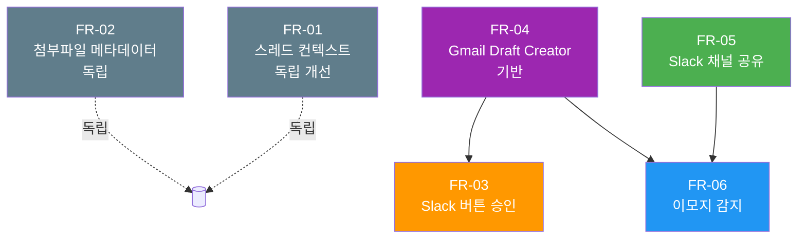

# 이메일 워크플로우 개선 구현 계획

**버전**: v1.0.0
**날짜**: 2026-02-23
**복잡도**: STANDARD (3/5)
**연관 PRD**: `docs/00-prd/email-workflow.prd.md`
**GitHub 이슈**: `#email-workflow`

---

## 1. 개요

Gmail 수신 → 분석 → 초안 → Slack 공유 → ✅ 이모지 승인 → Gmail Draft 생성 전체 사이클을 구현한다.

### 1.1 복잡도 분석

| 항목 | 수치 |
|------|------|
| 신규 파일 | 6개 |
| 수정 파일 | 7개 |
| 외부 의존성 | Slack Block Kit, Slack Events API, Gmail Draft API |
| 추정 단계 | Phase 1 ~ Phase 8 |

### 1.2 연관 FR 요약

| FR | 제목 | 우선순위 |
|----|------|---------|
| FR-01 | 이메일 스레드 컨텍스트 수집 및 분석 주입 | 5 |
| FR-02 | 첨부파일 메타데이터 추출 | 6 |
| FR-03 | Slack 버튼 승인 (Block Kit) | 3 |
| FR-04 | 승인 후 Gmail Draft 자동 생성 | 4 |
| FR-05 | Slack 채널에 이메일 초안 전체 공유 | 1 |
| FR-06 | Slack ✅ 이모지 리액션 감지 → Gmail Draft 생성 | 2 |

---

## 2. 영향 파일 목록

### 2.1 신규 파일 (6개)

| 파일 | FR | 역할 |
|------|----|------|
| `scripts/gateway/email_draft_creator.py` | FR-04 | `EmailDraftCreator` 클래스 — Gmail Draft 생성 오케스트레이터 |
| `scripts/gateway/slack_actions_handler.py` | FR-03 | Slack 버튼 클릭 웹훅 처리 (Signing Secret 검증) |
| `scripts/gateway/slack_events_handler.py` | FR-06 | `reaction_added` 이벤트 처리, URL verification |
| `scripts/gateway/draft_share_store.py` | FR-05/FR-06 | `DraftShareStore` — ts ↔ draft_id 매핑 SQLite 저장 |
| `tests/gateway/test_email_draft_creator.py` | FR-04 | TDD 테스트 파일 |
| `tests/gateway/test_slack_reaction.py` | FR-06 | TDD 테스트 파일 |

### 2.2 수정 파일 (7개)

| 파일 | FR | 변경 내용 |
|------|----|----------|
| `scripts/gateway/adapters/gmail.py` | FR-01, FR-02 | `thread_id` 명시 할당 + `_extract_attachments()` 헬퍼 추가 |
| `scripts/gateway/pipeline.py` | FR-01 | Stage 2.5 `GmailThreadContextStage` 추가 |
| `scripts/gateway/server.py` | FR-03, FR-06 | `POST /slack/actions`, `POST /slack/events` 엔드포인트 추가 |
| `scripts/reporter/alert.py` | FR-03, FR-05 | `format_slack_blocks()`, `format_full_draft()` 메서드 추가 |
| `scripts/reporter/channels/slack_dm.py` | FR-03, FR-05 | `send_blocks()`, `post_to_channel()` 메서드 추가 |
| `scripts/reporter/reporter.py` | FR-05 | `send_draft_to_channel()` 메서드 추가 |
| `scripts/intelligence/response/handler.py` | FR-01, FR-05 | `thread_context` 전달 + 초안 생성 후 채널 공유 트리거 |

---

## 3. 구현 단계

```mermaid
gantt
    title 이메일 워크플로우 구현 단계
    dateFormat  X
    axisFormat  Phase %s

    section TDD
    Phase 1: TDD Red (테스트 먼저)  : 1, 2

    section 기반
    Phase 2: FR-02 첨부파일 메타데이터   : 2, 3
    Phase 3: FR-04 Gmail Draft Creator  : 3, 4

    section 핵심
    Phase 4: FR-05 Slack 채널 공유      : 4, 5
    Phase 5: FR-06 이모지 리액션 감지   : 5, 6

    section 보완
    Phase 6: FR-03 Slack 버튼 승인      : 6, 7
    Phase 7: FR-01 스레드 컨텍스트      : 7, 8

    section 통합
    Phase 8: 통합 및 설정               : 8, 9
```

---

### Phase 1: TDD Red — 테스트 파일 먼저 작성 (모두 FAIL 확인)

**목적**: TDD 원칙에 따라 구현 전 테스트 먼저 작성. 모든 테스트가 FAIL 상태인지 확인.

#### `tests/gateway/test_email_draft_creator.py` (FR-04)

```python
import pytest
from unittest.mock import AsyncMock, MagicMock, patch

class TestEmailDraftCreator:
    async def test_create_from_draft_success(self):
        """draft_id로 Gmail Draft 생성 성공"""
        # EmailDraftCreator.create_from_draft("test-draft-id") 호출
        # GmailAdapter._create_gmail_draft가 호출되어야 함
        # gmail_draft_id가 DB에 저장되어야 함
        ...

    async def test_auto_send_disabled(self):
        """자동 전송 코드 없음 검증 — Gmail send API 호출 금지"""
        ...

    async def test_duplicate_creation_prevented(self):
        """이미 gmail_draft_id가 있으면 중복 생성 않고 스킵"""
        ...

    async def test_draft_not_found_error(self):
        """존재하지 않는 draft_id 처리"""
        ...
```

#### `tests/gateway/test_slack_reaction.py` (FR-06)

```python
class TestSlackEventsHandler:
    async def test_url_verification_challenge(self):
        """Slack URL Verification challenge 응답"""
        ...

    async def test_reaction_added_triggers_draft_creation(self):
        """✅ 이모지 → Gmail Draft 생성 트리거"""
        ...

    async def test_signing_secret_verification(self):
        """Signing Secret 검증 실패 → 401"""
        ...

    async def test_unknown_draft_id_ignored(self):
        """매핑 없는 ts의 이모지는 무시"""
        ...

    async def test_non_checkmark_emoji_ignored(self):
        """white_check_mark 외 이모지 무시"""
        ...

    async def test_bot_reaction_ignored(self):
        """봇의 이모지는 무시"""
        ...
```

**검증**: `pytest tests/gateway/test_email_draft_creator.py tests/gateway/test_slack_reaction.py -v` → 모두 FAIL

---

### Phase 2: FR-02 첨부파일 메타데이터 (독립, 가장 빠름)

**파일**: `scripts/gateway/adapters/gmail.py`

**구현 내용**:

```python
SUPPORTED_ATTACHMENT_MIMES = {
    "application/pdf",
    "image/jpeg",
    "image/png",
    "image/gif",
    "application/msword",
    "application/vnd.openxmlformats-officedocument.wordprocessingml.document",
    "application/vnd.ms-excel",
    "application/vnd.openxmlformats-officedocument.spreadsheetml.sheet",
    "application/vnd.ms-powerpoint",
    "application/vnd.openxmlformats-officedocument.presentationml.presentation",
}

def _extract_attachments(self, parts: list) -> list[dict]:
    """
    Gmail 메시지 파트에서 첨부파일 메타데이터 추출.
    파일 내용 다운로드 절대 금지.
    """
    attachments = []
    for part in parts:
        mime_type = part.get("mimeType", "")
        if mime_type not in SUPPORTED_ATTACHMENT_MIMES:
            continue
        body = part.get("body", {})
        if not body.get("attachmentId"):
            continue  # 인라인 이미지 등 무시
        attachments.append({
            "filename": part.get("filename", "unknown"),
            "mime_type": mime_type,
            "size_bytes": body.get("size", 0),
            "attachment_id": body["attachmentId"],  # 참조용만, 다운로드 금지
        })
    return attachments
```

**NormalizedMessage 텍스트 요약**:
```
원본 텍스트...

---
[첨부파일]
- report.pdf (application/pdf, 200 KB)
```

---

### Phase 3: FR-04 Gmail Draft Creator (공통 의존성)

**신규 파일**: `scripts/gateway/email_draft_creator.py`

```python
from __future__ import annotations

import logging
from typing import TYPE_CHECKING

if TYPE_CHECKING:
    from scripts.gateway.adapters.gmail import GmailAdapter
    from scripts.intelligence.response.draft_store import DraftStore

logger = logging.getLogger(__name__)


class EmailDraftCreator:
    """Intelligence DB 초안 → Gmail Draft 생성 오케스트레이터."""

    def __init__(self, gmail_adapter: "GmailAdapter", draft_store: "DraftStore"):
        self.gmail = gmail_adapter
        self.drafts = draft_store

    async def create_from_draft(self, draft_id: str) -> dict:
        """
        draft_id로 Gmail Draft 생성.

        Returns:
            {"gmail_draft_id": str, "status": "created" | "skipped"}
        """
        # 1. 중복 생성 방지
        existing = await self.drafts.get_gmail_draft_id(draft_id)
        if existing:
            logger.info(f"Draft {draft_id} already has gmail_draft_id={existing}, skipping")
            return {"gmail_draft_id": existing, "status": "skipped"}

        # 2. 초안 내용 로드
        draft = await self.drafts.get(draft_id)
        if not draft:
            raise DraftNotFoundError(f"Draft {draft_id} not found")

        # 3. Gmail Draft 생성 (전송 절대 금지)
        gmail_draft_id = await self.gmail._create_gmail_draft(
            to=draft["recipient"],
            subject=draft["subject"],
            body=draft["body"],
        )

        # 4. DB 업데이트
        await self.drafts.set_gmail_draft_id(draft_id, gmail_draft_id)
        return {"gmail_draft_id": gmail_draft_id, "status": "created"}


class DraftNotFoundError(Exception):
    pass
```

**DB 마이그레이션**:
```sql
-- data/intelligence.db
ALTER TABLE drafts ADD COLUMN gmail_draft_id TEXT;
ALTER TABLE drafts ADD COLUMN approved_at TEXT;
```

서버 시작 시 `IntelligenceStorage._init_db()`에서 자동 실행 (존재하면 스킵).

---

### Phase 4: FR-05 Slack 채널 초안 공유

**신규 파일**: `scripts/gateway/draft_share_store.py`

```python
class DraftShareStore:
    """초안 공유 메시지 ts ↔ draft_id 매핑 저장."""

    CREATE_TABLE_SQL = """
        CREATE TABLE IF NOT EXISTS draft_share_messages (
            id INTEGER PRIMARY KEY AUTOINCREMENT,
            channel_id TEXT NOT NULL,
            ts TEXT NOT NULL,
            draft_id TEXT NOT NULL,
            project_id TEXT,
            processed_at TEXT,
            created_at TEXT DEFAULT CURRENT_TIMESTAMP,
            UNIQUE(channel_id, ts)
        );
        CREATE INDEX IF NOT EXISTS idx_dsm_draft_id
            ON draft_share_messages(draft_id);
    """

    async def save_share(
        self, draft_id: str, channel_id: str, ts: str, project_id: str | None = None
    ) -> None: ...

    async def get_draft_id(self, channel_id: str, ts: str) -> str | None: ...

    async def mark_processed(self, channel_id: str, ts: str) -> None: ...
```

**`scripts/reporter/alert.py`** 변경:
- `DraftNotification`에 `text_full: str | None = None` 필드 추가
- `format_full_draft()` → 채널 공유용 포맷 문자열 반환

**`scripts/reporter/channels/slack_dm.py`** 변경:
- `post_to_channel(channel_id: str, text: str) -> str` 추가 (returns `ts`)

**`scripts/reporter/reporter.py`** 변경:
- `send_draft_to_channel(draft_id: str, project_id: str) -> None` 추가
  1. `config/projects.json`에서 intelligence 채널 조회
  2. `SlackDMChannel.post_to_channel()` 호출
  3. 성공 시 `DraftShareStore.save_share()` 호출
  4. 실패 시 로그만 남기고 계속 (비차단)

**`scripts/intelligence/response/handler.py`** 변경:
- `_generate_draft()` 완료 후 `reporter.send_draft_to_channel()` 호출

---

### Phase 5: FR-06 Slack ✅ 이모지 리액션 감지

**신규 파일**: `scripts/gateway/slack_events_handler.py`

```python
import asyncio
import hashlib
import hmac
import time

class SlackEventsHandler:
    """Slack Events API 이벤트 처리."""

    def __init__(
        self,
        signing_secret: str,
        draft_share_store: DraftShareStore,
        email_draft_creator: EmailDraftCreator,
        slack_client,  # 스레드 답글 전송용
    ):
        self.signing_secret = signing_secret
        self.store = draft_share_store
        self.creator = email_draft_creator
        self.slack = slack_client

    def verify_signature(self, body: bytes, timestamp: str, signature: str) -> bool:
        """X-Slack-Signature 헤더 검증."""
        if abs(time.time() - float(timestamp)) > 300:  # 5분 이상 지난 요청 거부
            return False
        base = f"v0:{timestamp}:{body.decode()}"
        expected = "v0=" + hmac.new(
            self.signing_secret.encode(), base.encode(), hashlib.sha256
        ).hexdigest()
        return hmac.compare_digest(expected, signature)

    async def handle(self, body: bytes, timestamp: str, signature: str) -> dict:
        """
        Returns: {"status": "ok"} or raises ValueError for auth failure
        """
        if not self.verify_signature(body, timestamp, signature):
            raise ValueError("Invalid Slack signature")

        payload = json.loads(body)

        # URL Verification
        if payload.get("type") == "url_verification":
            return {"challenge": payload["challenge"]}

        event = payload.get("event", {})

        # reaction_added + white_check_mark + message 필터
        if not self._should_process(event):
            return {"status": "ignored"}

        # Background에서 처리 (3초 내 응답 보장)
        asyncio.create_task(self._process_reaction(event))
        return {"status": "ok"}

    def _should_process(self, event: dict) -> bool:
        return (
            event.get("type") == "reaction_added"
            and event.get("reaction") == "white_check_mark"
            and event.get("item", {}).get("type") == "message"
            and not event.get("bot_id")  # 봇 이모지 무시
        )

    async def _process_reaction(self, event: dict) -> None:
        channel_id = event["item"]["channel"]
        ts = event["item"]["ts"]

        draft_id = await self.store.get_draft_id(channel_id, ts)
        if not draft_id:
            return  # 초안 공유 메시지가 아님

        # 중복 처리 방지
        await self.store.mark_processed(channel_id, ts)

        result = await self.creator.create_from_draft(draft_id)
        if result["status"] == "created":
            await self.slack.chat_postMessage(
                channel=channel_id,
                thread_ts=ts,
                text="Gmail Draft가 생성되었습니다. Gmail에서 전송해주세요.",
            )
```

**`scripts/gateway/server.py`** 변경:
```python
@app.post("/slack/events")
async def slack_events(request: Request):
    body = await request.body()
    timestamp = request.headers.get("X-Slack-Timestamp", "")
    signature = request.headers.get("X-Slack-Signature", "")

    try:
        result = await events_handler.handle(body, timestamp, signature)
        return JSONResponse(result)
    except ValueError:
        return JSONResponse({"error": "Unauthorized"}, status_code=401)
```

---

### Phase 6: FR-03 Slack 버튼 승인 (대안 승인 방법)

**`scripts/reporter/alert.py`** 변경:
```python
def format_slack_blocks(self) -> list[dict]:
    """Block Kit 버튼 메시지 형식 생성."""
    return [
        {"type": "header", "text": {"type": "plain_text", "text": "📧 이메일 회신 초안 생성"}},
        {
            "type": "section",
            "fields": [
                {"type": "mrkdwn", "text": f"*발신자:*\n{self.sender}"},
                {"type": "mrkdwn", "text": f"*제목:*\n{self.subject}"},
            ],
        },
        {
            "type": "section",
            "text": {"type": "mrkdwn", "text": f"*초안 요약:*\n{self.text[:300]}..."},
        },
        {
            "type": "actions",
            "elements": [
                {
                    "type": "button",
                    "text": {"type": "plain_text", "text": "✅ 승인 (Gmail Draft 생성)"},
                    "style": "primary",
                    "action_id": "approve_draft",
                    "value": self.draft_id,
                },
                {
                    "type": "button",
                    "text": {"type": "plain_text", "text": "❌ 거절"},
                    "style": "danger",
                    "action_id": "reject_draft",
                    "value": self.draft_id,
                },
            ],
        },
    ]
```

**신규 파일**: `scripts/gateway/slack_actions_handler.py`
- `SlackActionsHandler.handle()`: Signing Secret 검증 → action_id 파싱 → 승인/거부 처리

**`scripts/gateway/server.py`** 변경:
```python
@app.post("/slack/actions")
async def slack_actions(request: Request):
    # application/x-www-form-urlencoded payload 파싱
    ...
```

---

### Phase 7: FR-01 스레드 컨텍스트 주입

**`scripts/gateway/adapters/gmail.py`** 변경:
```python
# _poll_new_messages() 내에서
msg = NormalizedMessage(
    ...
    thread_id=raw_msg.get("threadId"),  # 명시 할당 (기존에는 raw_json에만 있음)
    ...
)
```

**`scripts/gateway/pipeline.py`** 변경:
```python
class GmailThreadContextStage:
    """Stage 2.5: EMAIL 채널에서 스레드 컨텍스트 수집 (비차단)."""

    async def process(self, message: NormalizedMessage, context: dict) -> NormalizedMessage:
        if message.channel_type != "email" or not message.thread_id:
            return message  # 스킵
        try:
            thread_ctx = await asyncio.wait_for(
                self.profiler.get_thread_context(message.thread_id),
                timeout=3.0,
            )
            message.raw_json["thread_context"] = thread_ctx
        except asyncio.TimeoutError:
            logger.warning(f"Thread context timeout for {message.thread_id}")
        except Exception as e:
            logger.warning(f"Thread context error: {e}")
        return message  # 실패해도 파이프라인 계속
```

**`scripts/intelligence/response/handler.py`** 변경:
- `_generate_draft()` 프롬프트 빌드 시 `thread_context` 섹션 추가

---

### Phase 8: 통합 및 설정

**`config/gateway.json`** 변경:
```json
{
  "slack_signing_secret": "${SLACK_SIGNING_SECRET}",
  "slack_events": {
    "enabled": true,
    "endpoint": "/slack/events"
  },
  "slack_actions": {
    "enabled": true,
    "endpoint": "/slack/actions"
  }
}
```

**전체 테스트 실행**:
```bash
pytest tests/gateway/test_email_draft_creator.py -v  # FR-04 GREEN 확인
pytest tests/gateway/test_slack_reaction.py -v        # FR-06 GREEN 확인
pytest tests/ --ignore=tests/test_actions.py -v       # 전체 회귀 테스트
```

**수동 E2E 검증**:
1. ngrok으로 로컬 서버 공개 (`ngrok http 8800`)
2. Slack App Interactivity URL, Event Subscriptions URL 설정
3. Gmail 테스트 이메일 발송
4. Slack intelligence 채널에서 초안 공유 메시지 확인
5. ✅ 이모지 추가
6. 스레드 답글 "Gmail Draft 생성 완료" 확인
7. Gmail > Drafts 폴더에서 Draft 존재 확인
8. **자동 전송 없는 것 확인**

---

## 4. 재사용 가능한 기존 구현

| 기존 구현 | 위치 | 활용 FR | 비고 |
|-----------|------|---------|------|
| `GmailThreadProfiler.get_thread_context()` | `scripts/knowledge/gmail_thread_profiler.py` | FR-01 | 파이프라인 연결만 필요 |
| `GmailAdapter._create_gmail_draft()` | `scripts/gateway/adapters/gmail.py` | FR-04 | 이미 구현됨, 래핑만 |
| `retry` 데코레이터 | `scripts/shared/retry.py` | FR-04 | Gmail API 재시도 |
| `RateLimiter` 싱글톤 | `scripts/shared/rate_limiter.py` | 전체 | 기존 설정 유지 |
| `CLI drafts approve/reject` | `scripts/intelligence/cli.py` | FR-03 후에도 | 하위호환 유지 |
| `UnifiedStorage` | `scripts/gateway/storage.py` | FR-05/FR-06 | `gateway.db` 연결 재사용 |
| `IntelligenceStorage` | `scripts/intelligence/context_store.py` | FR-04 | `intelligence.db` 연결 재사용 |

---

## 5. 위험 요소 및 대응

| 위험 | 확률 | 영향 | 대응 |
|------|------|------|------|
| Slack Interactivity / Events URL 설정 필요 | 높음 | 높음 | 개발: ngrok. 운영: 서버 공개 URL. README에 설정 가이드 추가. |
| `lib.gmail.GmailClient` 접근 방식 불일치 | 중간 | 중간 | `GmailAdapter`에서 직접 Gmail API 호출하는 fallback 구현. |
| `data/intelligence.db` 스키마 변경 부작용 | 낮음 | 낮음 | `ALTER TABLE`은 가역적. 서버 시작 시 자동 마이그레이션. |
| Slack Signing Secret 미설정 | 높음 | 높음 | `config/gateway.json` 명시 문서화. 미설정 시 서버 시작 실패로 조기 감지. |
| `reaction_added` 이벤트 중복 수신 | 중간 | 낮음 | `draft_share_messages.processed_at`으로 중복 방지. |
| Stage 2.5 타임아웃으로 파이프라인 지연 | 낮음 | 낮음 | 3초 타임아웃 + 비차단 처리. 실패해도 파이프라인 계속. |

---

## 6. 검증 방법

### 6.1 단위 테스트

```bash
# Phase 1 TDD Red 확인
pytest tests/gateway/test_email_draft_creator.py tests/gateway/test_slack_reaction.py -v
# 예상: ALL FAILED

# Phase 3~8 구현 후 Green 확인
pytest tests/gateway/test_email_draft_creator.py tests/gateway/test_slack_reaction.py -v
# 예상: ALL PASSED

# 전체 회귀
pytest tests/ --ignore=tests/test_actions.py -v
# 예상: ALL PASSED (기존 테스트 깨지지 않음)
```

### 6.2 수동 통합 테스트

| 단계 | 검증 항목 | 예상 결과 |
|------|----------|----------|
| 1 | Gmail 테스트 이메일 발송 | Gateway 수신 로그 확인 |
| 2 | 첨부파일 포함 이메일 발송 | `raw_json["attachments"]` 확인 |
| 3 | Intelligence 초안 생성 | `data/intelligence.db drafts` 테이블 확인 |
| 4 | Slack 채널 공유 메시지 확인 | intelligence 채널에 메시지 표시 |
| 5 | ✅ 이모지 추가 | 3초 내 `/slack/events` 200 응답 |
| 6 | Gmail Draft 생성 확인 | Gmail > Drafts 폴더에서 존재 확인 |
| 7 | 자동 전송 없음 확인 | Gmail > Sent 폴더에 메시지 없음 |
| 8 | CLI 하위호환 | `python scripts/intelligence/cli.py drafts approve <id>` 정상 동작 |

---

## 7. 의존성 그래프



### 구현 순서 (권장)

```
Phase 1: TDD Red (테스트 파일 먼저)
  ↓
Phase 2: FR-02 (독립, 빠름)
  ↓
Phase 3: FR-04 (공통 기반)
  ↓
Phase 4: FR-05 (채널 공유)
  ↓
Phase 5: FR-06 (이모지 감지)
  ↓
Phase 6: FR-03 (버튼 승인)
  ↓
Phase 7: FR-01 (스레드 컨텍스트)
  ↓
Phase 8: 통합 및 E2E 검증
```

---

## 8. 설정 가이드

### 8.1 Slack App 설정 (신규)

1. **Event Subscriptions 활성화**
   - Slack App → Event Subscriptions → Enable Events
   - Request URL: `https://YOUR_SERVER/slack/events`
   - Subscribe to bot events: `reaction_added`

2. **Interactivity 활성화**
   - Slack App → Interactivity & Shortcuts → Enable Interactivity
   - Request URL: `https://YOUR_SERVER/slack/actions`

3. **Bot Token Scope 추가**
   - `reactions:read` (reaction_added 이벤트 수신)

4. **Signing Secret 설정**
   - Slack App → Basic Information → App Credentials → Signing Secret
   - 환경변수: `SLACK_SIGNING_SECRET=xxxxx`

### 8.2 로컬 개발 설정 (ngrok)

```bash
# ngrok 설치 후
ngrok http 8800
# 생성된 https URL을 Slack App에 등록

# Gateway 서버 시작
python scripts/gateway/server.py start --port 8800
```

### 8.3 운영 설정

```bash
# 환경변수 설정
export SLACK_SIGNING_SECRET=xxxxxxxxxxxxxxxxxxx

# Gateway 서버 시작 (서버 공개 URL 필요)
python scripts/gateway/server.py start --port 8800
```
